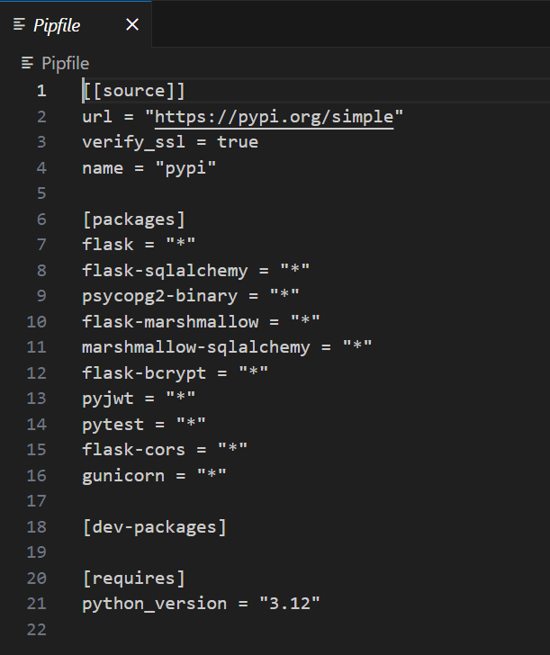

ReadMe

- This was my final project to bring together most of the skills i'd learnt over the course of my bootcamp.
  I chose to work alone as this enabled this work to be fully my own and to display my understanding of the tech stack involved, it's also nice to be able to debug on your own and build confidence in yourself.
  In brief, my task was to build a full stack app incorporating a Python Flask API using a Flask REST framework to serve my data from a Postgres database.
  My project idea I settled on was to build a Recipe Sharing platform where users can browse, search, and share recipes. Users can create profiles, upload recipes with images, categorise recipes by cuisine or meal type, and leave reviews. Implement features like user authentication, image uploading, and search functionality.

Deployment link

- Here is the deployment link to my project - Tasteful Trove
  [Link](https://main--tasteful-trove.netlify.app/)
  Feel free to sign up and create an account, but if you want to use the demo user the details are as follows:
  email: nick@nick.com
  password: meditate

  Getting Started/Code Installation:

- Feel free to access my code via my GitHub repository:
  Front end - https://github.com/MBroadbent95/project4-frontend
  Back end - https://github.com/MBroadbent95/project4-backend
  Necessary Installations are as follows:
  Front end:
- TailwindCSS
- Axios
- TypeScript
- React

Back end:

- Python version 3.12
- Flask
- Flask-SQLAlchemy
- Psycopg2
- Flask-Marshmallow
- Flask-Bcrypt
- Pyjwt
- Pytest
- Flask-Cors
- Gunicorn

I have included snippets of what your package & pipfile's should look like.

You will likely need to have your own Postgres database up and running, and then to seed the data in order to get this working as intended.
Once you have installed all necessary dependencies & Postgres is live, you will need to:
Back end, run seed. Then once seeded, pipenv run flask run.
Front end, npm run dev.
If you have successfully completed my steps, you should have a working preview by this point.

Timeframe & Working Team (Solo/Pair/Group):

- The timeframe was 12/4 until the afternoon of 23/4, just under 11 days including weekends.
  I worked solo for this project.

Technologies Used:

Back end:
Python
Flask
Node
Axios
Bcrypt
Pyjwt
Pytest
Psycopg2
Marshmallow
Gunicorn

Front end:
HTML
TailwindCSS
Vite
Axios
React
React-dom
React-router-dom
React-scripts
TypeScript

Development tools:
Heroku
Netlify
Google Chrome Dev Tools

Brief:

- Build a full-stack application by making your own backend and your own front-end.
- Use a Python Flask API using a Flask REST Framework to serve your data from a Postgres database.
- Consume your API with a separate front-end built with React.
- Be a complete product which most likely means multiple relationships and CRUD functionality for at least a couple of models.
- Implement thoughtful user stories/wireframes that are significant enough to help you know which features are core MVP and which you can cut.
- Have a visually impressive design to kick your portfolio up a notch and have something to wow future clients & employers. ALLOW time for this.
- Be deployed online so it's publicly accessible.

Planning:

As with all projects, it's well known that how good your project can be is entirely dependent on how much energy you put into planning in the beginning, it was no different here.
From the outset I drew up a rough wireframe of what I had in mind via Excalidraw, this can be seen below.

I wanted this project to be a smooth and polished experience, whilst we do run the risk of the final product being basic and bland without many impressive features, I felt confident that prioritising a clean mvp was a better display of my knowledge and ability than the alternative.

Build/Code Process:

This project needed a good plan if I was to make it through to the end with any app to show for it. As such, my inner project manager took the wheel and I threw together a rough road map for the time ahead of me. Call it a quirk but I love to know where I am in the wider project picture and can't stand now knowing how much needs to be done in X time.
Please see my roadmap below, I added a couple of tasks as I went but the wider picture remained consistent.

Much like my previous projects, I decided it would be best to start out with a functional back end. Once that is up and tested, we would then proceed to create a front end and carry on.
My instructors had recently shown me how to test back end functions through automatic testing, this appeared to be a godsend with how much time it would save me testing each individual endpoint on Insomnia.
Once they were written, the tests returned with positive results, my endpoints were working as intended.
Tests are interesting pieces of code to write and execute, I know this is a practice which I will use in the future considering how useful it was.

Here are a couple of code snippets testing get and delete respectively, take a look!:

This was my first project using a Python, Flask & PostgreSQL back end, so being relatively new, i lifted a lot of the code from previous coursework and re-applied it to my current project, this worked like a charm and i was able to have my back end up, and tested before the end of the second day, a little behind schedule but the roadmap was optimistic.

At the start of the following week, I was to build my basic front end structure, frameworks and all, and get it talking with my backend so that I can start meaningfully assembling the UI.
In a previous project, I had started using TailwindCSS for my front end framework. TailwindCSS makes CSS styling so smooth and painless as possible, whilst TailwindCSS can be annoying to install correctly, I'm glad I used it in this project too.

On Tuesday I looked into enabling an image upload system so that my users could include a picture of their recipe. 
Personally I rarely cook food from recipes without illustrations so this was essential.
Unfortunately this research proved to be much longer than anticipated and I couldn't get my head around the technology effectively.
At this time I was experiencing errors in other areas of the project, namely in the comments and recipe submission/ posting parts. In light of this, I decided it was best to keep the image upload system basic with Imgur links and focus on debugging my other components.
Moving forward I would be interested in learning the technology for image uploading and display, we all know that Imgur uploading is very clunky and not friendly towards the User Experience.

As I recall, on Wednesday I was experiencing persistent issues with my comments system which required attention. I had noticed that it stopped working once I modified my comments serializer on my back end to include Foreign Keys or include_fk. I needed the code to stay the same if I was to keep my Get_Comment function from breaking. I had a crazy idea to create a new comment serializer with everything the same except the include_fk. To my surprise this worked like a charm and whilst it feels like a hack, like a dumb solution, my instructor assured me that it was perfectly fine and in fact not a hack, but it sure feels like one.
See my 'hack' code below haha.

Thursday was the day before deployment, so ideally MVP would be achieved in order for a smooth deploy process.
Since debugging was something I did as I went along, by midday of thursday, MVP was achieved and I could style, test any endpoints I felt anxious about, and finally populate my api with some tasty recipes.
Data population has always been a tedious part of the development process, so it was always gonna take a dedicated period of time to populate correctly. I decided on 8 recipes as a start to populate the page, 2 users, and 2 comments. We could always log in to add more manually, or even re-seed, I did re-seed a couple of times in this project, initially to check if everything was working as it should and then finally to populate.

The final couple of days I spent ad-hoc debugging and placing the finishing styles onto my front end.
The live URL is 
Feel free to sign up, add a recipe and comments if you wish. I'm rather happy with the deployed result, there are many improvements to be made and a couple of bugs which I will discuss shortly.

Moving forward

Challenges:

- A lot of the way Flask works was confusing for me in the beginning, but the more I got my hands on it the more it seemed to make sense.

- One challenge was in the comment serializer, include_fk, this broke my comment system once I added it, and whilst there most certainly is going to be a more elegant solution, my solution was to just create another serializer for posting comments and keep the old one for GET requests. I created the SuperComment serializer which was literally the exact same minus the include_fk and a rename. Just one of those programming quirks which kind of disappoint you when they work.

- Model adjustment, despite saying in my mission statement that I was going to include image uploads, I actually forgot to include images in my initial recipe model, this wasn't super impactful over the span of the project but it does mean I need to bust my own ass to plan a bit more.

Wins:

- Making everything work together was the big victory here. Flask and SQLAlchemy work a bit differently to MongoDB and express, for example MongoDB gives you an id automatically but postgreSQL does not, this was initially rather annoying but I like that I was able to figure out a couple of these quirks throughout this project and make them work for what I wanted to achieve.
- Effective planning was also a considerable win here. Knowing at what stage I am at allows me to assess what to do next and how long I have to spend. Had I not had a roadmap, it is very possible I may have lost more time trying to integrate image uploads and fall behind schedule.

Key Learnings/Takeaways:

This project has helped me develop my confidence with utilising alternative backend frameworks and doing the necessary tasks to understand and integrate those newer frameworks, like Python & Flask, with older more familiar ones such as React.

I have demonstrated to myself that whilst my final product may not be perfect and could probably use stronger styles and a couple more features, I can certainly deliver a clean and functional full stack project within just over a week without asking for much help and assistance. This I am very proud of and brings me confidence moving into future employment.

Bugs:

- The option to delete your original user posted comment only appears after you navigate to another page and then return.
- Infrequently, the images of particular recipes will not load correctly.

Future Improvements:

- Favourites for users, would be awful nice if I could create a shortlist of recipes I like the look of instead of needing to find them every time. It's fine when there's a small number, but once we get over 30 recipes this will gradually make the user experience suffer.

- Admin User, An admin user would've been great to keep the page in check, this can be done with minimal adjustments but my roadmap demanded my attention in other areas.

- User Profile Page, this would have been a large undertaking from scratch and was unlikely to get finished in time if i wanted a smooth mvp, but ideally this feature would include the ability to delete your data, upload a profile picture to add to your comment along with your name, and possibly a dropdown menu to access your favourites.
