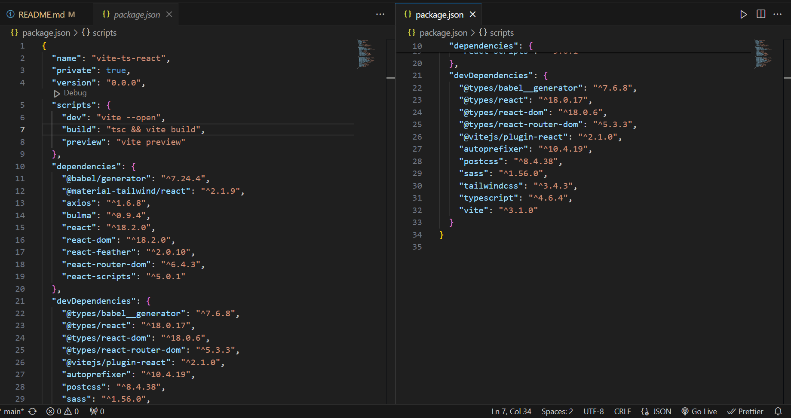

ReadMe Sections

Description

Instructions

Here, give a short description of the project. It can be a couple of sentences where you discuss the point in time during the course that you completed it, the topic of the project and potentially the tech stack.

- This was my final project to bring together most of the skills i'd learnt over the course of my bootcamp.
  I chose to work alone as this enabled this work to be fully my own and to display my understanding of the tech stack involved, it's also nice to be able to debug on your own and build confidence in yourself.
  In brief, my task was to build a full stack app incorporating a Python Flask API using a Flask REST framework to serve my data from a Postgres database.
  My project idea i settled on wasv to build a Recipe Sharing platform where users can browse, search, and share recipes. Users can create profiles, upload recipes with images, categorize recipes by cuisine or meal type, and leave reviews. Implement features like user authentication, image uploading, and search functionality.

Deployment link

Instructions

Here include the information on where the deployed project can be found. If login details are needed to access the full project, make sure you include them.

- Here is the deployment link to my project - Tasetful Trove
  [Link](https://main--tasteful-trove.netlify.app/)
  Feel free to sign up and create an account, but if you want to use the demo user the details are as follows:
  email: nick@nick.com
  password: meditate

  Getting Started/Code Installation

Instructions

Explain how the reader accesses your code. Include a step by step approach.

- Feel ffee to access my code via my GitHub repository:
  Front end - https://github.com/MBroadbent95/project4-frontend
  Back end - https://github.com/MBroadbent95/project4-backend
  Necessary Installations are as follows:
  Front end:
- TailwindCSS
- Axios
- TypeScript
- React

Back end:

- Python version 3.12
- Flask
- Flask-SQLAlchemy
- Psycopg2
- Flask-Marshmallow
- Flask-Bcrypt
- Pyjwt
- Pytest
- Flask-Cors
- Gunicorn

I have included snippets of what your package & pipfile's should look like.

You will likely need to have your own Postgres database up and running, and then to seed the data in order to get this working as intended.
Once you have installed all necessary dependencies & Postgres is live, you will need to:
Back end, run seed. Then once seeded, pipenv run flask run.
Front end, npm run dev.
If you have successfully completed my steps, you should have a working preview by this point.

Timeframe & Working Team (Solo/Pair/Group)

Instructions

Share the timeframe given for the project and whether you worked independently, in a pair, or in a group.

If you worked in a pair or group, include the names of the people you collaborated with. As a bonus, you can also provide links to their GitHub repo.

- The timeframe was 12/4 until the afternoon of 23/4, just under 11 days including weekends.
  I worked solo for this project.

Technologies Used:

Back end:
Python
Flask
Node
Axios
Bcrypt
Pyjwt
Pytest
Psycopg2
Marshmallow
Gunicorn

Front end:
HTML
TailwindCSS
Vite
Axios
React
React-dom
React-router-dom
React-scripts
TypeScript

Development tools:
Heroku
Netlify
Google Chrome Dev Tools

Brief
Instructions:

- Build a full-stack application by making your own backend and your own front-end.
- Use a Python Flask API using a Flask REST Framework to serve your data from a Postgres database.
- Consume your API with a separate front-end built with React.
- Be a complete product which most likely means multiple relationships and CRUD functionality for at least a couple of models.
- Implement thoughtful user stories/wireframes that are significant enough to help you know which features are core MVP and which you can cut.
- Have a visually impressive design to kick your portfolio up a notch and have something to wow future clients & employers. ALLOW time for this.
- Be deployed online so it's publicly accessible.

Planning:

As with all projects, it's well known that how good your project can be is entirely dependent on how much energy you put into planning in the beginning, it was no different here.
From the outset i drew up a rough wireframe of what i had in mind via Excalidraw, this can be seen below.

I wanted this project to be a smooth and polished experience, whilst we do run the risk of the final product being basic and bland without many impressive features, i felt confident that prioritising a clean mvp was a better display of my knowlege and ability than the alternative.

Build/Code Process

Instructions:

This project needed a good plan if i was to make it through to the end with any app to show for it. As such, my inner project manager took the wheel and i threw together a rough road map for the time ahead of me. Call it a quirk but i love to know where i am in the wider project picture and can't stand now knowing how much needs to be done in X time.
Please see my roadmap below, i added a couple of tasks as i went but the wider picture remained consistent.

Much like my previous projects, I decided it would be best to start out with a functional back end. Once that is up and tested, we would then proceed to create a front end and carry on.
My instructors had recently shown me how to test back end functions through automatic testing, this appeared to be a godsend with how much time it would save me testing each individual endpoint on Insomnia.
Once they were written, the tests returned with positive results, my end points were working as intended.
Tests are interesting pieces of code to write and execute, I know this is a practice which i will use in the future considering how useful it was.

Here are a couple of code snippets testing get and delete respectively, take a look!:

This was my first project using a Python, Flask & PostgreSQL back end, so being relatively new, i lifted a lot of the code from previous coursework and re-applied it to my current project, this worked like a charm and i was able to have my back end up, and tested before the end of the second day, a little behind schedule but the roadmap was optimistic.

At the start of the following week, I was to build my basic front end structure, frameworks and all, and get it talking with my backend so that i can start meaningfully assembling the UI.
In a previous project, i had started using TailwindCSS for my front end framework. TailwindCSS makes CSS styling so smooth and painless as possible, whilst TailwindCSS can be annoying to install correctly, i'm glad i used it in this project too.

On the Tuesday i looked into enabling an image upload system so that my users could include a picture of their recipe, personally i rarely cook food from recipes without illustrations so this was essential.
Unfortunately this research proved to be much longer than anticipated and i couldn't get my head around the technology effectively.
At this time i was experiencing errors in other areas of the project, namely in the comments and recipe submission/ posting parts. In light of this, I decided it was best to keep the image upload system basic with Imgur links and focus on debugging my other components.
Moving forward i would be interested in learning the technology for image uploading and display, we all know that Imgur uploading is very clunky and not friendly towards the User Experience.

As i recall, on Wednesday i was experiencing persistent issues with my comments system which required attention. I had noticed that it stopped working once i modified my comments serializer on my back end to include Foreign Keys or include_fk. I needed the code to stay the same if i was to keep my Get_Comment function from breaking. I had a crazy idea to create a new comment serializer with everything the same except the include_fk. To my surprise this worked like a charm and whilst it feels like a hack, like a dumb solution, my instructor assured me that it was perfectly fine and in fact not a hack, but it sure feels like one.
See my 'hack' code below haha.

Thursday was the day before deployment, so ideally MVP would be achieved in order for a smooth deploy process.
Since debugging was something I did as I went along, by midday of thursday, MVP was achieved and I could style, test any endpoints I felt anxious about, and finally populate my api with some tasty recipes.
Data population has always been a tedious part of the development process for me, so it was always gonna take a dedicated period of time to populate correctly. I decided on 8 recipes as a start to populate the page, 2 users, and 2 comments. We could always log in to add more manually, or even re-seed, I did re-seed a couple of times in this project, initially to check if everything was working as it should and then finally to populate.

The final couple of days i spent ad-hoc debugging and placing the finishing styles onto my front end.
The live URL is 
Feel free to sign up, add a recipe and comments if you wish. I'm rather happy with the deployed result, there are many improvements to be made and a couple of bugs which i will discuss shortly.

-----------------------------------------------------------You are Here --------------------------------------------

Moving forward

Challenges

Instructions

Challenges are great for showing your learning journey and problem solving, and this is a section that many engineers will check out. Every day of your engineering career you’ll encounter challenges, this is part of your growth and development. It’s the challenges you encounter that helps you become a stronger and more competent engineer.

Here you will detail any particular challenges you encountered as you were coding the project.

Questions to answer here:

What technical challenges did you come across?
Why were these challenges?
What problem solving did you do to rectify them?
Team dynamics/ Project management
Tools/Tech you used

Wins

Instructions

The Wins section is your opportunity to highlight the aspects of your project you are most proud of. See this as your chance to showcase these parts of your projects to the engineers reading your ReadMes.

Things you could discuss here:

Interesting problem solving you did
Strong sections of code
Collaboration with other team members
Visual design of the project

Key Learnings/Takeaways

Instructions

This section is one of the other most important parts of your ReadMe from an engineers’ perspective and helps to differentiate each of you from your classmates and team members.

Engineers love to understand what you learn from each project and how it has shaped you as an engineer.

See this as your opportunity to show the engineers how your skills grew during each project sprint.

Things you could discuss here:

What Technologies/Tools do you now feel more confident with? Tell them specifically what you learnt about these.
What engineering processes did you become more comfortable with? Standups? Pair programming? Project management? Tell them what you learnt from these processes?

Bugs

Instructions

If you have any bugs in your project, it’s important that you flag them in your ReadMe. This helps the engineers reviewing your projects to understand that you are aware that there are issues - if you don’t flag these, then they won’t have that visibility that you know these problems are in your code and it can result in them not having a full understanding of your technical knowledge.

In either sentences or bullets, explain what the bugs are.

If you have no bugs, you can leave this section blank.

Future Improvements

Instructions

It’s common to get to the end of your project and have ideas on what you would do if you have more time, as well as how you might improve it.

If you do, you should detail this here. It’s great to give that context on potential future improvements, to share your creative or technical ideas with the engineers reading your ReadMes.

In either sentences or bullets, explain what your future improvements would be.
